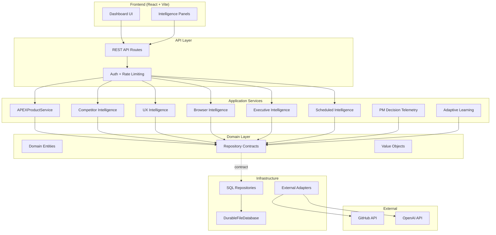
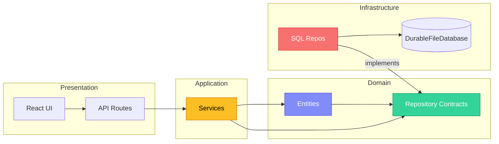
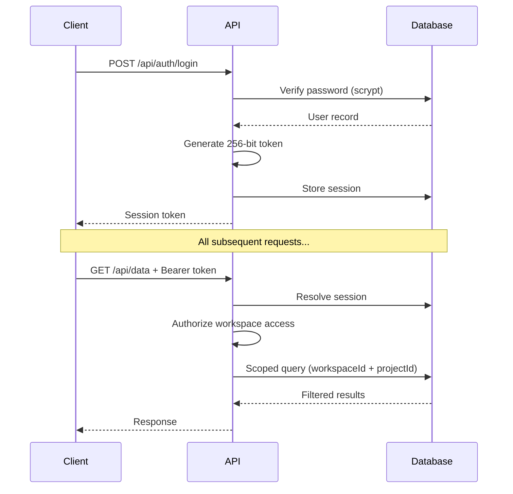
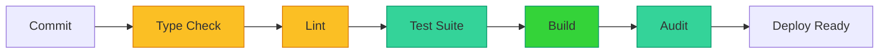

<div align="center">

# 🚀 APEX — Autonomous Product Excellence

**An AI-powered Autonomous Chief Product Officer that continuously discovers opportunities, analyzes products, prioritizes work, generates documentation, and helps teams build better software.**

<br/>


<br/>


</div>

---

## 📋 Table of Contents

- [Overview](#-overview)
- [Architecture](#-architecture)
- [Features](#-features)
- [Tech Stack](#-tech-stack)
- [Getting Started](#-getting-started)
- [Project Structure](#-project-structure)
- [Security](#-security)
- [Quality Gates](#-quality-gates)
- [Development](#-development)
- [Roadmap](#-roadmap)
- [License](#-license)

---

## 🌟 Overview

APEX is a **production-grade, multi-tenant AI product management platform** built with strict Domain-Driven Design (DDD) and Clean Architecture principles. It transforms raw product data into actionable intelligence through a sophisticated pipeline of analysis, reasoning, and automated decision support.

### What Makes APEX Unique

- **🧠 Epistemic Integrity** — Every metric, score, and recommendation carries explicit provenance and confidence levels. Unknown data remains unknown; nothing is fabricated.
- **🔒 Multi-Tenant Security** — Workspace-scoped isolation with `(id, workspaceId, projectId)` triple-key protection across all 9 SQL repositories.
- **📊 Continuous Intelligence** — Automated competitor analysis, UX insights, browser crawling, and executive reporting with scheduled execution.
- **🎯 Adaptive Learning** — The system learns from PM decisions through H6 calibration and H7 telemetry, continuously improving its recommendations.

---

## 🏗️ Architecture

### System Architecture Diagram



### Domain-Driven Design Flow



---

## ✨ Features

### 🎯 Intelligence Modules

| Module                           | Description                                                                                | Status      |
| -------------------------------- | ------------------------------------------------------------------------------------------ | ----------- |
| **H9: Competitor Intelligence**  | Feature matrices, positioning analysis, differentiation factors, market opportunities      | ✅ Complete |
| **H10: UX Intelligence**         | User journey tracking, friction detection, usability scoring, optimization recommendations | ✅ Complete |
| **H11: Browser Intelligence**    | Crawl jobs, content hashing, rate limiting, robots.txt compliance, session tracking        | ✅ Complete |
| **H12: Executive Intelligence**  | Health dashboards, trend detection, investment opportunities, risk forecasts, reports      | ✅ Complete |
| **V2.1: Scheduled Intelligence** | Recurring jobs, cron scheduling, retry with backoff, execution history, metrics            | ✅ Complete |

### 🔐 Security Features

| Feature              | Implementation                                                              |
| -------------------- | --------------------------------------------------------------------------- |
| **Multi-Tenancy**    | `(id, workspaceId, projectId)` triple-key isolation across all repositories |
| **Authentication**   | Scrypt password hashing (memory-hard), 256-bit random session tokens        |
| **Rate Limiting**    | 60 requests/minute per workspace per endpoint                               |
| **API Security**     | All routes behind `authenticateAndAuthorize` middleware                     |
| **Input Validation** | Regex-validated GitHub names, typed request bodies                          |
| **Audit Trail**      | Every action, decision, and outcome is recorded with provenance             |

### 📊 Analytics & Reporting

- **Real-time Dashboards** — Live product health metrics with epistemic annotations
- **Executive Reports** — 8-section reports with markdown/JSON/PDF export
- **Trend Detection** — Automated market evolution and technology trend analysis
- **Confidence Scoring** — Every metric tagged with evidence source and confidence level

### 🧠 Learning & Adaptation

- **H6 Adaptive Calibration** — Empirical category coefficients with minimum-observation thresholds
- **H7 PM Decision Telemetry** — Real decision latency tracking with timestamp integrity
- **Learning Signals** — Provenance-tracked insights that feed back into the system
- **Priority Scoring** — Explainable, immutable scoring formulas

---

## 🛠️ Tech Stack

### Core Technologies

| Category            | Technology   | Version           |
| ------------------- | ------------ | ----------------- |
| **Language**        | TypeScript   | 6.0 (strict mode) |
| **Runtime**         | Node.js      | 24+               |
| **Frontend**        | React        | 19                |
| **Styling**         | Tailwind CSS | 4                 |
| **Bundler**         | Vite         | 8                 |
| **Package Manager** | pnpm         | 9                 |
| **Monorepo**        | Turborepo    | 2                 |

### Key Dependencies

| Package                        | Purpose                          |
| ------------------------------ | -------------------------------- |
| `@octokit/rest`                | Real GitHub API integration      |
| `react-markdown`               | Safe markdown rendering (no XSS) |
| `remark-gfm`                   | GitHub-flavored markdown support |
| `vitest`                       | Test runner with 707+ tests      |
| `eslint` + `typescript-eslint` | Linting and type safety          |
| `husky` + `lint-staged`        | Pre-commit quality gates         |
| `commitlint`                   | Conventional commit enforcement  |

### Architecture Patterns

- **Domain-Driven Design (DDD)** — Clean separation of domain, application, and infrastructure
- **Repository Pattern** — Database-agnostic data access contracts
- **CQRS-lite** — Separate read/write paths for complex entities
- **Event Sourcing** — Action transitions recorded as immutable audit trail

---

## 🚀 Getting Started

### Prerequisites

- **Node.js** 24+ (LTS recommended)
- **pnpm** 9+ (install via `npm install -g pnpm`)

### Installation

```bash
# Clone the repository
git clone https://github.com/magdimohamed1991/apex-ai-product-manager.git
cd apex-ai-product-manager

# Install dependencies
pnpm install

# Start development server
pnpm dev
```

The dashboard will be available at `http://localhost:5173`.

### Environment Variables

| Variable         | Required   | Description                          |
| ---------------- | ---------- | ------------------------------------ |
| `OPENAI_API_KEY` | Production | OpenAI API key for LLM reasoning     |
| `GITHUB_TOKEN`   | Optional   | GitHub token for repository analysis |
| `NODE_ENV`       | Optional   | Set to `production` for strict mode  |

> **Note:** In development mode, APEX uses a deterministic mock LLM provider. Production mode requires a real OpenAI API key.

### Quick Commands

```bash
pnpm dev          # Start development server
pnpm type-check   # Run TypeScript type checking
pnpm lint         # Run ESLint
pnpm test         # Run all tests (707+ tests)
pnpm build        # Build for production
pnpm audit        # Check for security vulnerabilities
```

---

## 📁 Project Structure

```
apex-ai-product-manager/
├── apps/
│   └── web/                          # React Dashboard (Vite)
│       ├── src/
│       │   ├── api-server.ts         # Express-style API routes
│       │   ├── features/
│       │   │   └── dashboard/
│       │   │       ├── components/   # React UI components
│       │   │       ├── api/          # API client
│       │   │       ├── types/        # TypeScript types
│       │   │       └── hooks/        # React hooks
│       │   └── ...
│       └── vite.config.ts
├── packages/
│   └── ai-core/                      # Core Business Logic
│       └── src/
│           ├── domain/
│           │   ├── entities/         # Domain models (20 files)
│           │   └── repositories/     # Repository contracts (12 files)
│           ├── application/
│           │   └── services/         # Business logic (19 services)
│           ├── infrastructure/
│           │   ├── database/         # DurableFileDatabase
│           │   └── repositories/     # SQL implementations (9 files)
│           ├── security/             # Auth, rate limiting
│           ├── observability/        # Logging
│           └── errors/               # Typed error handling
├── docs/                             # Documentation
│   ├── ARCHITECTURE.md
│   ├── TECH_STACK.md
│   └── ...
└── .github/                          # CI/CD workflows
```

### Domain Entities

| Entity               | Purpose                                  |
| -------------------- | ---------------------------------------- |
| `Action`             | Execution record with lifecycle tracking |
| `Execution`          | Action execution results and history     |
| `ActionTransition`   | Immutable audit trail for state changes  |
| `Competitor`         | Competitor profiles and analysis         |
| `UserJourney`        | User experience tracking                 |
| `CrawlJob`           | Browser intelligence crawl jobs          |
| `ExecutiveDashboard` | Product health metrics                   |
| `ScheduledJob`       | Recurring intelligence tasks             |

---

## 🔒 Security

### Multi-Tenancy Model

Every data access is scoped by **workspace** and **project**:

```
┌─────────────────────────────────────┐
│           Workspace (Tenant)        │
│  ┌───────────────────────────────┐  │
│  │         Project               │  │
│  │  ┌─────────────────────────┐  │  │
│  │  │  (id, workspaceId,      │  │  │
│  │  │   projectId)            │  │  │
│  │  └─────────────────────────┘  │  │
│  └───────────────────────────────┘  │
└─────────────────────────────────────┘
```

### Security Audit Results

| Category           | Status   | Details                                               |
| ------------------ | -------- | ----------------------------------------------------- |
| SQL Injection      | ✅ Clean | No raw SQL — typed in-memory filters                  |
| Path Traversal     | ✅ Clean | Regex-validated inputs only                           |
| Command Injection  | ✅ Clean | `execFileSync` (no shell) + input validation          |
| XSS                | ✅ Clean | No `dangerouslySetInnerHTML`, safe markdown rendering |
| CSRF               | ✅ Clean | Bearer token authentication required                  |
| SSRF               | ✅ Clean | Simulated crawler (no real HTTP requests)             |
| Credential Leakage | ✅ Clean | No secrets in logs, environment-based config          |

### Authentication Flow



---

## 📊 Quality Gates

### Automated Checks

Every commit passes through:



### Test Coverage

| Category              | Count   | Status                 |
| --------------------- | ------- | ---------------------- |
| **Unit Tests**        | 674     | ✅ All passing         |
| **Integration Tests** | 33      | ✅ All passing         |
| **Total Tests**       | **707** | ✅ **100% passing**    |
| **Test Files**        | 61      | Comprehensive coverage |

### Quality Metrics

| Metric                   | Value           | Target |
| ------------------------ | --------------- | ------ |
| Type Check               | ✅ 8/8 packages | 100%   |
| Lint Errors              | 0               | 0      |
| Test Pass Rate           | 100%            | 100%   |
| Build Success            | ✅              | 100%   |
| Security Vulnerabilities | 0               | 0      |
| Production Readiness     | **9.2/10**      | ≥ 9.0  |

---

## 🛠️ Development

### Code Quality

- **TypeScript Strict Mode** — Zero `any` types, full type safety
- **ESLint** — Custom rules for domain integrity
- **Prettier** — Consistent code formatting
- **Husky** — Pre-commit hooks for quality gates
- **Commitlint** — Conventional commit enforcement

### Development Workflow

```bash
# Make changes
vim packages/ai-core/src/domain/entities/NewEntity.ts

# Verify changes
pnpm type-check
pnpm lint
pnpm test

# Commit (auto-runs pre-commit hooks)
git add .
git commit -m "feat: add new entity"

# Push (triggers CI)
git push origin main
```

### Architecture Rules

1. **Domain Layer** — Never depends on infrastructure
2. **Application Layer** — Orchestrate domain logic only
3. **Infrastructure** — Implements domain contracts
4. **Frozen Core** — Never modify: `Action.ts`, `Execution.ts`, `ActionTransition.ts`, `ActionRepository.ts`, `ActionApplicationService.ts`, `ActionExecutor.ts`, `ActionExecutionWorker.ts`

---

## 🗺️ Roadmap

### ✅ Completed (H1–H12, V2.1)

- [x] Multi-tenant security and authentication
- [x] Product intelligence pipeline
- [x] Action lifecycle management
- [x] GitHub integration
- [x] PM decision telemetry (H7)
- [x] Adaptive learning (H6)
- [x] Competitor intelligence (H9)
- [x] UX intelligence (H10)
- [x] Browser intelligence (H11)
- [x] Executive intelligence (H12)
- [x] Scheduled intelligence (V2.1)

### 🚧 In Progress

- [ ] Continuous Intelligence optimization
- [ ] Market signal aggregation
- [ ] Pricing intelligence

### 📋 Planned

- [ ] V2.2: Market Intelligence Engine
- [ ] V2.3: Pricing Intelligence
- [ ] V2.4: Alerting (Slack, Teams, Email)
- [ ] V2.5: Strategic Memory
- [ ] V2.6: Forecasting
- [ ] V2.7: Integrations (Linear, Jira, Notion)

---

## 📚 Documentation

| Document                                                                      | Description                   |
| ----------------------------------------------------------------------------- | ----------------------------- |
| [Architecture](docs/ARCHITECTURE.md)                                          | System design and patterns    |
| [Tech Stack](docs/TECH_STACK.md)                                              | Technologies and dependencies |
| [Database](docs/DATABASE.md)                                                  | DurableFileDatabase design    |
| [Design System](docs/DESIGN_SYSTEM.md)                                        | UI component patterns         |
| [Workflows](docs/WORKFLOWS.md)                                                | Business process flows        |
| [Stabilization Report](packages/ai-core/docs/H9-H12-STABILIZATION-REPORT.md)  | H9–H12 audit results          |
| [Engineering Report](packages/ai-core/docs/ENGINEERING-REMEDIATION-REPORT.md) | Full audit findings           |

---

## 🤝 Contributing

1. **Fork** the repository
2. **Create** a feature branch (`git checkout -b feat/amazing-feature`)
3. **Commit** changes (`git commit -m 'feat: add amazing feature'`)
4. **Push** to branch (`git push origin feat/amazing-feature`)
5. **Open** a Pull Request

### Commit Convention

We use [Conventional Commits](https://www.conventionalcommits.org/):

```
feat:     New feature
fix:      Bug fix
docs:     Documentation changes
style:    Code style changes (formatting, etc.)
refactor: Code refactoring
test:     Adding or updating tests
chore:    Build process or auxiliary tool changes
```

---

## 📄 License

This repository is currently **UNLICENSED**. All rights reserved.

Adding a license requires an explicit decision by the repository owner.

---

<div align="center">

**Built with ❤️ by the APEX Team**

[](https://twitter.com/apex_ai)
[](https://github.com/magdimohamed1991)

---

_APEX — Transforming product management with AI-powered intelligence_

</div>
